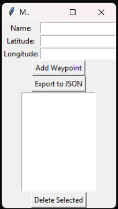

# 🗺️ Mission Planner Lite

**Mission Planner Lite** is a lightweight, desktop-based waypoint management tool built with Python and Tkinter. Designed to simulate basic mission or route planning functionality, this application allows users to input, view, and export waypoints in a clean and user-friendly interface.

> Built for learning, demonstration, and portfolio development — no proprietary code, no NDA restrictions.

---

## 📸 Screenshot



---

## ✨ Features

- 🧭 Add, view, and delete named waypoints with latitude and longitude
- 📤 Export waypoint lists to `.json` format
- 🧼 Simple GUI with list interface using Python Tkinter
- ✅ Includes unit tests for core logic
- 💡 Easy to extend for mapping or altitude/distance support

---

## 📁 Project Structure

```
mission_planner_lite/
├── main.py             # GUI code
├── planner.py          # Waypoint logic handler
├── test_planner.py     # Unit tests using unittest
├── waypoints.json      # Sample export file
├── requirements.txt    # (minimal for this project)
└── README.md           # This file
```

---

## 🚀 Getting Started

### ✅ Prerequisites

- Windows 11 (or other OS with Python 3.10+)
- [Python 3.10+](https://www.python.org/downloads/)
- Tkinter (usually bundled with Python on Windows)

### 📦 Installation

1. Clone the repository:
   ```bash
   git clone https://github.com/ThisIsMikeyS/mission-planner-lite.git
   cd mission-planner-lite
   ```

2. (Optional) Create a virtual environment:
   ```bash
   python -m venv venv
   venv\Scripts\activate
   ```

3. Install required packages:
   ```bash
   pip install tk
   ```

---

## ▶️ Running the App

To start the GUI:
```bash
python main.py
```

---

## 🧪 Running Tests

To run the unit tests:
```bash
python test_planner.py
```

Expected output:
```
..
----------------------------------------------------------------------
Ran 2 tests in 0.000s

OK
```

---

## 💾 Sample Output (`waypoints.json`)
```json
[
  {
    "name": "Alpha",
    "lat": 51.5074,
    "lon": -0.1278
  },
  {
    "name": "Bravo",
    "lat": 52.2053,
    "lon": 0.1218
  }
]
```

---

## 🛠️ Future Improvements

- Map-based display using OpenStreetMap or Folium
- Import/export CSV
- Altitude/time per waypoint
- Path visualization
- REST API or local DB support

---

## 📚 License

This project is licensed under the MIT License — see [LICENSE](LICENSE) for details.

---

## 🧑‍💻 Author

**Michael Saunders**  
Freelance Software & Systems Developer | Technical Writer  
[LinkedIn](https://www.linkedin.com/in/michael-saunders-805785128/) · [GitHub](https://github.com/ThisIsMikeyS)

---
